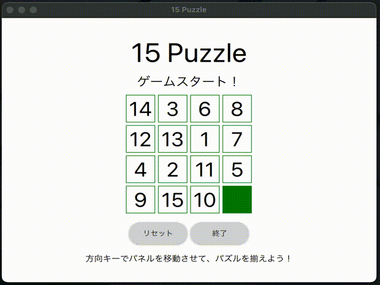

# 15Puzzle

C++の学習用に作成したパズルゲームです。

GUI描画にQt Quickを使っています。

CLI実行にも対応していて、 `--cli` をつけて端末で実行するとCLI実行されます。

## 参考文献

- [Introduction to Qt | Qt 6.6](https://doc.qt.io/qt-6/qt-intro.html)
- [Building a QML application | Build with CMake 6.6.1](https://doc.qt.io/qt-6/cmake-build-qml-application.html)
